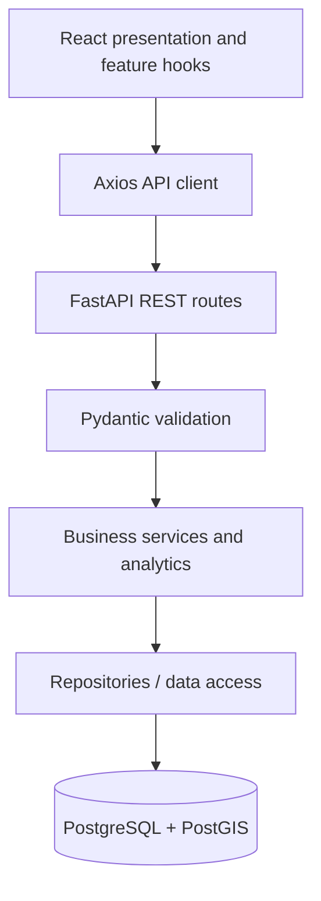
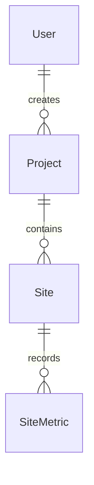

# Architecture

## Modular monolith

Darukaa.Earth consists of a React browser application and one FastAPI application backed by PostgreSQL/PostGIS. Feature modules share a single database and deployment unit for the API. This keeps local setup and transactions understandable while allowing clear internal boundaries. Microservices add no value to the current scope.

## Boundaries

- `frontend/src/app`: routing, shell and public environment configuration.
- `components`: reusable presentation; `features`: auth, projects, sites, map, analytics and dashboard boundaries. Feature directories are empty until their module.
- `services/api.ts`: shared Axios instance and timeout. Later feature API functions use it rather than creating clients in components.
- `backend/app/api`: thin HTTP routes and request dependencies.
- `schemas`: request/response contracts; `services`: business rules and transaction decisions; `repositories`: persistence queries. Create abstractions when used, not empty generic repository frameworks.
- `models`: persistence mapping, with no business logic. `db`: shared metadata, lazy engine, sessions and explicit verification.
- `analytics`: future metric calculations separated from HTTP and presentation.
- `core`: validated environment settings. Database URLs use SecretStr to reduce accidental logging.

Synchronous SQLAlchemy/psycopg is sufficient for the initial workload. Future database routes should be synchronous FastAPI handlers or explicitly manage thread execution; do not block the event loop with synchronous database calls inside async handlers. Request sessions close automatically; services will own commits and rollback behavior.

## Database relationships (Module 02)

The first migration defines User, Project, Site and SiteMetric, with server-generated UUIDs and timezone-aware audit timestamps. Projects have required ownership, name and constrained lifecycle status. Sites store validated `geometry(Polygon,4326)` with a GiST index and generated geodesic area in hectares. Metrics have one sample per site/time. User deletion is restricted while projects exist; project/site deletion cascades to descendants. An opt-in seed supplies clearly labeled synthetic examples. Project type/dates and GeoJSON API contracts remain future-module work. See [database design](module-02-database.md) for constraints, indexes, timestamp triggers and operational commands.

## Foundation decisions

- Root npm workspace: one lockfile and one Husky installation. Backend has a separate virtual environment and dependency lock.
- Root `.env`: Compose, backend and Vite share configuration; only VITE-prefixed variables are browser-visible.
- Docker image `postgis/postgis:17-3.5`: PostgreSQL 17 plus PostGIS, persistent named volume, loopback-only port, healthcheck. The tag is an upstream patch stream, not immutable; record the verified image digest before deployment.
- Alembic has a working migration environment and GeoAlchemy2 helpers; no revisions or business models are introduced in Module 01.
- Module 02 adds revision `0001_core_schema`. Model discovery includes the complete model package; migrations restrict their transaction search path to `public` so extension-owned Tiger/Topology tables are not treated as application drift. Unexpected application tables remain detectable. Integration tests apply/reverse migrations only in disposable PostgreSQL databases.
- `/api/health` reports API liveness independent of PostgreSQL, allowing useful isolated tests.
- Module 03 protects the placeholder routes with centralized React auth state, shared Axios Bearer headers and a reusable backend get_current_user dependency. Registration/login/me use schemas → AuthService → UserRepository; Argon2id hashes and expiring JWTs use existing user columns without a migration. Authorization currently requires an active authenticated account; resource ownership rules remain future feature work. See [authentication design](module-03-authentication.md).
- Module 04 adds owner-scoped ProjectRepository queries, transaction-owning ProjectService, explicit request/response schemas and thin authenticated routes. React project pages share the existing Axios and auth infrastructure. No schema changes were required. See [project management](module-04-projects.md).
- Module 05 provides a lazy Mapbox workspace with a reusable map component, explicit lifecycle cleanup and a typed onReady integration point for future GeoJSON layers. No site data or drawing is connected. See [map infrastructure](module-05-mapbox.md).
- Module 06 adds nested owner-scoped site routes with typed GeoJSON/PostGIS conversion, database geometry validation and the existing generated area column. Project/site screens reuse MapView and own their Draw controls, sources, layers and event cleanup.
- Module 07 adds read-only metric/analytics routes, deterministic Decimal-based summaries, opt-in synthetic site seeding and reusable accessible Highcharts components. No scientific provenance is claimed.
- Module 08 uses seven bounded aggregate/overview queries for an owner-scoped dashboard, without relationship loops. React displays backend KPIs and charts, including null values and coverage. Models and migration history remain unchanged. Review library/provider license and usage requirements before public deployment.

## Verification and evolution

Module 09 filters existing owner-scoped project/site lists in the browser, persists filter state in URL parameters, and connects map discovery to one selected project's sites. No API or schema changes are needed. Project/site detail and drawing pages load lazily. Module 10 extends API authorization/edge-case and browser recovery coverage, type-checks browser tests, and provides a read-only source/build/scope audit. No CI/CD or deployment work is included. See [discovery](module-09-search-ux.md) and [testing](module-10-testing.md).

Health-contract and CORS tests validate actual HTTP behavior. Database verification uses SQLAlchemy and GeoAlchemy2 against real PostGIS. Hooks run staged-file checks; full lint/build/test commands are explicit. Later modules add focused tests when introducing behavior; Module 10 expands integration/end-to-end coverage rather than postponing all testing until then.

## Upstream references

- [Vite setup](https://vite.dev/guide/)
- [Husky setup](https://typicode.github.io/husky/get-started.html)
- [PostGIS image and initialization](https://hub.docker.com/r/postgis/postgis/)
