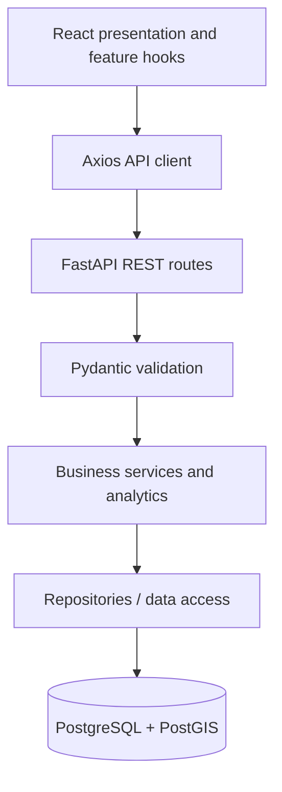
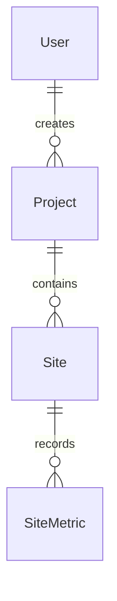

# Architecture

## Modular monolith

Darukaa.Earth consists of a React browser application and one FastAPI application backed by PostgreSQL/PostGIS. Feature modules share a single database and deployment unit for the API. This keeps local setup and transactions understandable while allowing clear internal boundaries. Microservices add no value to the current scope.

## Boundaries

- `frontend/src/app`: routing, shell and public environment configuration.
- `components`: reusable presentation; `features`: auth, projects, sites, map, analytics and dashboard boundaries. Feature directories are empty until their module.
- `services/api.ts`: shared Axios instance and timeout. Later feature API functions use it rather than creating clients in components.
- `backend/app/api`: thin HTTP routes and request dependencies.
- `schemas`: request/response contracts; `services`: business rules and transaction decisions; `repositories`: persistence queries. Create abstractions when used, not empty generic repository frameworks.
- `models`: persistence mapping, with no business logic. `db`: shared metadata, lazy engine, sessions and explicit verification.
- `analytics`: future metric calculations separated from HTTP and presentation.
- `core`: validated environment settings. Database URLs use SecretStr to reduce accidental logging.

Synchronous SQLAlchemy/psycopg is sufficient for the initial workload. Future database routes should be synchronous FastAPI handlers or explicitly manage thread execution; do not block the event loop with synchronous database calls inside async handlers. Request sessions close automatically; services will own commits and rollback behavior.

## Planned data relationships (Module 02 onward)

Projects include name, description, type, status, dates, creator and timestamps. Sites include project ownership, metadata and `geometry(Polygon,4326)`. GeoJSON carries boundaries across the API. PostGIS validates geometry and computes area using geography/metre-based calculations; do not compute square metres directly from longitude/latitude degrees. Plan spatial indexes and queries with Module 02/06. SiteMetric stores dated measurements with explicit units and synthetic provenance. Deletion rules, uniqueness constraints and indexes are finalized in Module 02. No business schema exists now.

## Foundation decisions

- Root npm workspace: one lockfile and one Husky installation. Backend has a separate virtual environment and dependency lock.
- Root `.env`: Compose, backend and Vite share configuration; only VITE-prefixed variables are browser-visible.
- Docker image `postgis/postgis:17-3.5`: PostgreSQL 17 plus PostGIS, persistent named volume, loopback-only port, healthcheck. The tag is an upstream patch stream, not immutable; record the verified image digest before deployment.
- Alembic has a working migration environment and GeoAlchemy2 helpers; no revisions or business models are introduced in Module 01.
- `/api/health` reports API liveness independent of PostgreSQL, allowing useful isolated tests.
- Placeholder routes are public during foundation. JWT auth, password hashing and role/access policy belong to Module 03.
- Highcharts and Mapbox are installed but unused until their modules. Review their license/usage requirements before public deployment.

## Verification and evolution

Health-contract and CORS tests validate actual HTTP behavior. Database verification uses SQLAlchemy and GeoAlchemy2 against real PostGIS. Hooks run staged-file checks; full lint/build/test commands are explicit. Later modules add focused tests when introducing behavior; Module 10 expands integration/end-to-end coverage rather than postponing all testing until then.

## Upstream references

- [Vite setup](https://vite.dev/guide/)
- [Husky setup](https://typicode.github.io/husky/get-started.html)
- [PostGIS image and initialization](https://hub.docker.com/r/postgis/postgis/)
