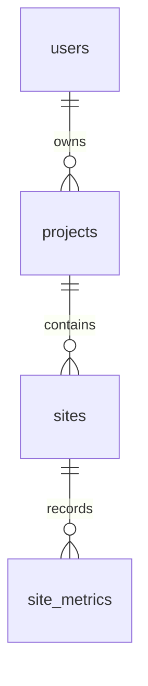

# Module 02: database, PostGIS and migrations

Module 02 adds persistence only. There are no registration/login, project/site APIs, frontend features or analytics services. `/api/health` is unchanged. Alembic is the schema source of truth; application startup and seed scripts never call `metadata.create_all()`.

## Entities and relationships



| Table        | Main columns and rules                                                                                                                            |
| ------------ | ------------------------------------------------------------------------------------------------------------------------------------------------- |
| users        | UUID id; unique non-null email up to 320 characters; nullable password_hash/full_name; is_active defaults true                                    |
| projects     | UUID id; required owner_id/name; nullable description; status defaults draft and permits draft/active/archived                                    |
| sites        | UUID id; required project_id/name; nullable description; non-null Polygon/4326 geometry; generated numeric(18,6) area_hectares                    |
| site_metrics | UUID id; required site_id/recorded_at; nullable numeric(16,4) carbon_value and numeric(7,4) biodiversity_value; at least one measurement required |

All four entities also carry `created_at` and `updated_at` as non-null timezone-aware timestamps. Import `User`, `Project`, `Site` and `SiteMetric` from `app.models`; that package registers the complete SQLAlchemy 2.x metadata for Alembic.

Project type and lifecycle dates from the wider product specification remain future project-management additions. This migration implements the explicitly scoped Module 02 project fields; no business workflows are introduced.

## Identity, email and status

PostgreSQL 17 provides `gen_random_uuid()` natively. Each primary key has this server default, so ORM and direct SQL inserts work without a supplied UUID. No UUID extension or application-generated default is needed. The seed explicitly supplies deterministic UUIDv5 identifiers from a fixed namespace.

Email values must already be lowercase and trimmed. A database check rejects non-normalized/empty values; a unique constraint prevents duplicates and supplies a B-tree index. Future application validation must trim and lowercase email before persistence, check syntax and explain validation errors. The database does not attempt full email syntax validation or silently modify input. Password hashes may be NULL until Module 03; NULL must never be treated as a valid password. There are no demo passwords or authentication routines.

Project status uses `varchar(20)` plus a named CHECK constraint instead of a PostgreSQL enum. This keeps allowed values enforced while making future additions an ordinary constraint migration, avoiding enum rollback complexity. Project/site names must be nonblank.

## Geometry and area

The existing `postgis/postgis:17-3.5` Docker image is unchanged. The migration executes `CREATE EXTENSION IF NOT EXISTS postgis`, including on a genuinely empty database that has not inherited the extension from a template. Migration execution therefore needs an extension-capable database role.

Site boundaries are two-dimensional PostGIS `geometry(POLYGON,4326)`, using WGS84 longitude/latitude. Typmod rejects incompatible geometry types and nonzero SRIDs other than 4326. Checks reject invalid/self-intersecting or empty polygons and coordinates outside longitude [-180,180] / latitude [-90,90]. No latitude/longitude scalar columns or geometry strings substitute for the canonical geometry column.

`area_hectares` is a PostgreSQL STORED generated column:

```sql
ST_Area(geometry::geography) / 10000.0
```

The geography overload measures spheroidal area in square metres. Dividing by 10,000 yields hectares; decimal storage rounds to six places. It is not planar area in degrees. PostgreSQL refreshes this value for every boundary insert/update, including bulk/direct SQL, preventing stale or manually fabricated area values. Callers omit this column when writing sites. A positive-area constraint also rejects degenerate geometries and areas that round to zero (less than approximately 0.005 square metres at this precision).

The deterministic area test uses a 0.01° by 0.01° square at the equator: roughly 1.11 km per side and approximately 123 hectares. Its 120–125 ha tolerance distinguishes geodesic area from incorrect degree-based results. Doubling its width is tested to approximately double stored area.

The MVP models regional polygons, not MultiPolygons. Cross-antimeridian and unusual global boundaries need explicit UX/API policy in Module 06; planar viewport operations do not automatically wrap longitude. Geometry checks are persistence safeguards; user-facing geometry validation/conversion belongs to future schemas/services.

## Indexes

| Index/constraint                 | Purpose                                                                        |
| -------------------------------- | ------------------------------------------------------------------------------ |
| Primary-key B-tree on each table | UUID lookup and references                                                     |
| uq_users_email                   | Unique normalized email; also serves email lookups                             |
| ix_projects_owner_id             | Owner's projects and FK lookups                                                |
| ix_sites_project_id              | Project's sites and FK lookups                                                 |
| idx_sites_geometry (GiST)        | ST_Intersects/viewport and spatial-region queries                              |
| uq_site_metrics_site_recorded_at | Unique site/time sample; composite B-tree for per-site chronological retrieval |
| ix_site_metrics_recorded_at      | Cross-site time-range queries                                                  |

One sample per site and instant is intentional: carbon and biodiversity observations for that instant share a row; later corrections update it. This prevents ambiguous duplicate time-series points. The composite index begins with site_id and also supports site-only lookups, avoiding a redundant standalone site_id index. Timestamp-only lookups have their own index. Query results still need explicit `ORDER BY recorded_at`; index order is not an API ordering guarantee.

## Foreign keys and deletion

| Relationship                    | Database behavior  | Reason                                                                                                            |
| ------------------------------- | ------------------ | ----------------------------------------------------------------------------------------------------------------- |
| projects.owner_id → users.id    | ON DELETE RESTRICT | A user with owned projects cannot be accidentally removed; transfer ownership or explicitly handle projects first |
| sites.project_id → projects.id  | ON DELETE CASCADE  | Site lifetime belongs to its project                                                                              |
| site_metrics.site_id → sites.id | ON DELETE CASCADE  | Metrics have no independent identity without their site                                                           |

SQLAlchemy relationships mirror these decisions. User.projects uses passive_deletes='all' so loaded relationships do not cause ORM NULL writes. Project.sites and Site.metrics use delete-orphan cascades and passive database deletion. Removing a child from an owned collection is therefore a deletion. Future APIs must authorize deletion and communicate its effects; this module does not expose delete endpoints. Deleting one project/site does not affect sibling projects or the user.

## Timestamps

All audit columns and recorded_at use `TIMESTAMP WITH TIME ZONE`. PostgreSQL stores absolute instants; the local Compose database uses UTC, and seed/test inputs carry explicit UTC offsets. Future API boundaries should normalize serialized values to UTC and reject naive timestamp inputs where necessary.

Audit columns default to `now()` on insertion. A single ordinary PostgreSQL trigger function, `darukaa_touch_updated_at`, sets updated_at to `statement_timestamp()` on UPDATE for each core table. This covers ORM, bulk and direct SQL consistently without relying on callers. `created_at` is not modified by the trigger. SQLAlchemy marks updated_at as server-generated on update; use refresh when immediately inspecting server-side changes. Trigger/function evolution requires explicit migration review because Alembic autogenerate does not diff trigger bodies.

## Synthetic demo policy and seed

**All seeded locations, project identities and metric values are synthetic hackathon examples.** Coordinates are plausible regional rectangles near the Western Ghats and Odisha wetlands, not surveyed parcels, real ownership boundaries, satellite data or scientific observations.

- One inactive demo user: `demo@darukaa.example`; NULL password_hash; no login credentials.
- Two illustrative projects, four differently sized polygon sites, and six monthly samples per site (January–June 2025), totaling 24 metrics.
- Carbon values are **demo carbon units**, not verified tonnes of CO₂ or credits; finite and nonnegative.
- Biodiversity values use an **application demo index from 0 to 100**, not a recognized ecological measurement scale.
- Nullable metrics express missing measurements; both NULL is rejected. No additional metric types are introduced.
- The dedicated seed module, project/site descriptions and this document label provenance. Metric rows currently have no separate source column; introduce a source/unit model before mixing real data in later analytics modules.

Seed UUIDs and timestamps are deterministic. `INSERT ... ON CONFLICT (id) DO NOTHING` inserts only missing seed rows and preserves existing changes. It never deletes/reset tables or overwrites existing rows. A conflicting email under a different UUID raises an error and rolls back the entire CLI transaction; the script does not adopt existing accounts. Concurrent reruns are protected by primary/unique constraints. If seed-owned names/measurements were edited, rerunning does not reset them.

From the repository root, PowerShell:

```powershell
docker compose config --quiet
docker compose up -d
docker compose ps
cd backend
.venv/Scripts/alembic.exe upgrade head
.venv/Scripts/alembic.exe current
.venv/Scripts/alembic.exe heads
.venv/Scripts/alembic.exe check
.venv/Scripts/python.exe -m app.db.seed --demo
.venv/Scripts/python.exe -m app.db.seed --demo
.venv/Scripts/python.exe -m app.db.verify
```

The second seed run should report zero inserted rows. The explicit `--demo` flag opts into synthetic data. No seed command runs on application startup. Root `.env` and the existing connection configuration are reused; this workstation uses host port **55432**, container port **5432**. Do not print resolved Compose configuration containing credentials; `config --quiet` validates without exposing them.

Migration revision: **0001_core_schema**. For an intentionally disposable database, `alembic downgrade base` removes application tables, associated indexes/triggers and the timestamp function. **It deletes application data.** The PostGIS extension is retained because it may predate the application or be shared. The empty Alembic version table may also remain. Do not downgrade the development database to run tests; the tests exercise this in a separately created database.

Alembic uses a transaction-local `search_path = public` for schema discovery and migration execution. The Docker image also installs Tiger/Topology support and normally adds those schemas to its search path. Restricting migration scope prevents extension tables from appearing as dropped application tables. It does not filter out unknown tables in public: a regression test verifies that unexpected public tables still cause `alembic check` to fail. The change is transaction-local and does not alter the database's persistent configuration.

## Integration tests

```powershell
# From backend, with the Docker database running:
.venv/Scripts/ruff.exe check .
.venv/Scripts/ruff.exe format --check .
.venv/Scripts/python.exe -m pytest -q
.venv/Scripts/python.exe -m pytest -q -m integration
.venv/Scripts/python.exe -m pip check
```

Tests connect to real PostgreSQL/PostGIS. The configured local DATABASE_URL supplies an admin connection; the role must have CREATEDB and extension-creation permission (the local Compose role does). Tests create randomly named `darukaa_test_<uuid>` databases from template0, apply Alembic, and delete only those generated databases in finally blocks. Individual cases roll back their transactions. The application database is never downgraded, cleared or seeded by the test suite. Missing database access is a failure, not a silent skip or SQLite fallback.

For a dedicated test server, explicitly set `TEST_DATABASE_ADMIN_URL` in the terminal environment before running tests. Without that explicit override, non-loopback hosts are refused. Never commit this URL if it includes credentials. Health-only tests remain independently runnable with `pytest tests/test_health.py`; they do not create a database.

Coverage includes real insert/default behavior, UUIDs, relationships, email uniqueness/normalization, status/metric/geometry constraints, SRID/type rejection, geodesic area and area updates, spatial intersection/containment/GeoJSON, timestamp triggers, chronological metrics, FK restrictions/cascades, idempotent seed and empty-database upgrade/downgrade/re-upgrade with model drift checks.

## Future API conversion boundary

Repositories will select PostGIS geometry and use `ST_AsGeoJSON` (or a deliberate equivalent converter). Services/schemas validate a GeoJSON-compatible object for API output. React/Mapbox receives GeoJSON, never GeoAlchemy2 WKBElement or another database-specific object. On writes, validated GeoJSON is converted to SRID 4326 PostGIS geometry before persistence; area remains database-derived. No Site API is implemented here.

## References

- [PostGIS ST_Area geography units](https://www.postgis.net/docs/ST_Area.html)
- [PostgreSQL 17 generated columns](https://www.postgresql.org/docs/17/ddl-generated-columns.html)
- [PostgreSQL 17 UUID functions](https://www.postgresql.org/docs/17/functions-uuid.html)
- [Alembic connection sharing](https://alembic.sqlalchemy.org/en/latest/cookbook.html)
