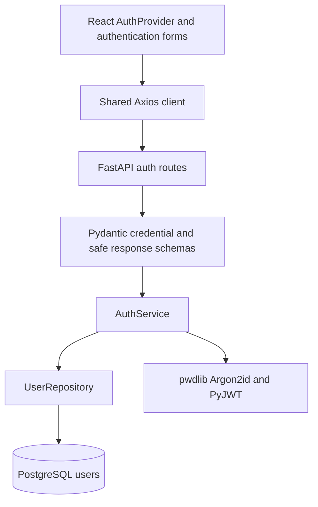
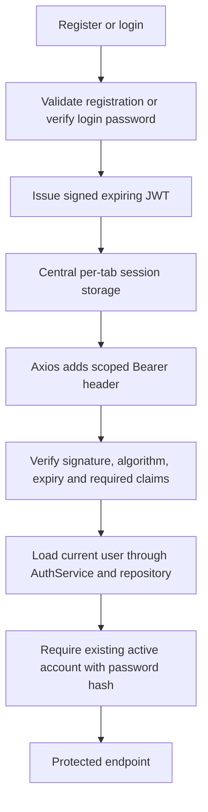

# Module 03: authentication and authorization

Authentication is implemented using the existing users table. No schema migration, user-model replacement, role system, project/site API or later-module feature was added. The inactive Module 02 demo account remains inactive with NULL password_hash and no login credentials.

## Architecture



Routes only delegate and return explicit response models. Services handle credential checks, registration transactions and token issuance. The repository contains user queries and inserts. `core/security.py` owns hashing and JWT validation without HTTP/database dependencies. Central API error handlers translate domain exceptions and redact validation input. No password, hash or token is logged by application code.

## Configuration

Add these root `.env` values before starting the backend:

```dotenv
JWT_SECRET_KEY=<generated-random-secret-at-least-32-characters>
JWT_ALGORITHM=HS256
JWT_ACCESS_TOKEN_EXPIRE_MINUTES=30
```

The example file contains a blank secret, never a usable default. The local developer `.env` has a generated 48-byte URL-safe random secret and stays ignored. Settings fail validation if the key is missing/short, an unsupported algorithm is configured, or lifetime is outside 1–1440 minutes. Only HS256 is supported in this MVP; the allowed algorithm is never taken from an untrusted token header. Use a randomly generated secret, not a repeated/predictable string. A secret can be generated locally with `python -c "import secrets; print(secrets.token_urlsafe(48))"`; store it only in your local environment/secret manager. Never prefix a signing secret with `VITE_`.

Restart the API after changing configuration. Changing the signing secret invalidates previously issued tokens. Unit/integration tests inject a fresh ephemeral key without using or exposing the developer key. Existing database and CORS configuration is unchanged.

## Password and email policy

- Registration passwords must contain 12–128 characters and cannot consist solely of whitespace.
- No arbitrary uppercase/symbol requirements; spaces in nonblank passphrases are preserved, never trimmed.
- Login accepts 1–128 characters so invalid credentials receive the generic authentication result, without imposing registration rules on future legacy hashes.
- `pwdlib.PasswordHash.recommended()` uses Argon2id with a per-password salt; only the encoded hash is persisted.
- Unknown users and NULL/invalid stored hashes perform dummy hash verification. This reduces obvious account-existence timing differences; it is not a claim of perfectly identical response timing.
- Email is trimmed/lowercased then validated through Pydantic EmailStr/email-validator. The database unique/normalization constraints remain authoritative.
- Registration checks for an existing email and also handles a concurrent database `uq_users_email` violation with rollback and HTTP 409.
- Full name is optional, trimmed and bounded to 200 characters. Unknown request fields are rejected; callers cannot assign activation flags.

Responses use `UserResponse`, an explicit allowlist: id, email, full_name and is_active. Models are never serialized wholesale. FastAPI validation errors exclude submitted `input` and `ctx`, avoiding accidental password reflection. Pydantic credential/settings representations hide secret values. Unexpected SQLAlchemy errors return a generic 503 without SQL parameters or exception text.

## HTTP contracts

All credentials use JSON, not form-encoded OAuth password flow. OpenAPI advertises HTTP Bearer authentication for protected routes.

| Endpoint                | Request                             | Response                                        |
| ----------------------- | ----------------------------------- | ----------------------------------------------- |
| POST /api/auth/register | email, password, optional full_name | 201: access_token, token_type, expires_in, user |
| POST /api/auth/login    | email, password                     | 200: same authentication envelope               |
| GET /api/auth/me        | Authorization: Bearer access token  | 200: safe current user                          |
| GET /api/health         | None                                | Unchanged Module 01 health JSON                 |

Registration creates an active account with an Argon2id hash and signs the user in immediately. Registration/login responses include `token_type: "bearer"`, remaining configured lifetime in seconds (`expires_in`), and safe user information. Successful authentication responses use `Cache-Control: no-store`.

Errors: invalid input 422; duplicate normalized email 409; invalid credentials, missing/malformed/expired token, unknown/deactivated/passwordless account 401 with `WWW-Authenticate: Bearer`; database unavailability 503. Login uses the same generic message for unknown email, wrong password and inactive/passwordless account. Explicit duplicate-registration feedback does disclose that an email is registered; this is an intentional usability tradeoff in the requested contract. No 403 role distinction is introduced: this module authorizes active authenticated users, and future resource-level ownership rules belong to their modules.

## JWT and dependency flow



Tokens contain only `sub` (UUID string), `iat` and `exp`. JWTs are signed, not encrypted; no password, email or hash is placed in them. Validation requires all three claims, an accepted algorithm/signature, an unexpired timestamp, integer time claims, expiry after issuance and a valid UUID subject. Oversized tokens are rejected. The dependency reloads the user on each request, so deactivation/deletion takes effect without waiting for token expiry.

Future routes can use `current_user = Depends(get_current_user)` or the typed alias:

```python
from app.api.dependencies import CurrentUser

# In a future protected route:
def protected_handler(current_user: CurrentUser):
    ...
```

No refresh tokens or server-side revocation list are implemented. Logout clears the browser session; a copied access token remains valid until expiry unless the account is deactivated/deleted or signing key changes.

## Frontend behavior

- `/login` and `/register` are public forms with pending/error states, labels and password autocomplete hints.
- `/`, `/dashboard`, `/projects`, `/map` and the application fallback are protected. `/` redirects authenticated users to `/dashboard`; the pages remain existing placeholders.
- A protected-page attempt redirects to login and remembers a safe, allowlisted local destination. Authenticated users visiting an auth page return to their workspace.
- AuthProvider exposes user, authentication/loading state, login/register/logout and session-retry behavior. Components do not independently store credentials or user state.
- Tokens use **sessionStorage**, centralized in `features/auth/session.ts`, with an in-memory fallback if storage is unavailable. They survive refresh in the same tab; closing the tab normally ends persistence. Browser tab cloning/session restoration may preserve it. Sessions are not synchronized across tabs.
- On refresh, `/auth/me` validates the stored token before protected content appears. A temporary network failure offers retry/sign-out rather than trusting unvalidated local user data.
- The existing Axios instance attaches Bearer tokens only to the configured API origin and path boundary, and excludes register/login. It strips Authorization from unrelated destinations. A 401 clears the session only when that failed request used the current token, preventing older-request failures from invalidating a newer session.
- A client timer clears an expired session. Client decoding is solely a UX mechanism; the backend remains the authentication authority.
- Logout clears token/current-user state and protected routing returns to login. There is no logout API because tokens are stateless.

Browser-accessible storage is vulnerable to token theft if same-origin script injection occurs. Session storage limits persistence but does not eliminate XSS risk. Before production, evaluate HttpOnly Secure cookies with an appropriate CSRF design, HTTPS, CSP, rate limiting/abuse protection, email verification, password recovery, and audit events without sensitive values. Those are documented hardening options, not implemented MVP features. Registration is currently public and there is no email-ownership verification or admin provisioning.

## Run and verify

Install updated dependencies at repository root:

```powershell
npm install
backend/.venv/Scripts/python.exe -m pip install -r backend/requirements-dev.lock.txt
backend/.venv/Scripts/python.exe -m pip install --no-deps -e ./backend
docker compose up -d
```

Start the API from backend after setting the JWT secret:

```powershell
.venv/Scripts/python.exe -m uvicorn app.main:app --reload --host 127.0.0.1 --port 8000
```

In another terminal at repository root, `npm run dev`. Open http://127.0.0.1:5173/login. Create your own local account through registration; the Module 02 seed account cannot log in. Do not commit personal credentials.

Backend checks, from backend:

```powershell
.venv/Scripts/ruff.exe check .
.venv/Scripts/ruff.exe format --check .
.venv/Scripts/python.exe -m pytest -q
.venv/Scripts/python.exe -m pip check
.venv/Scripts/alembic.exe check
.venv/Scripts/python.exe scripts/auth_smoke.py
```

The existing disposable-PostgreSQL integration fixtures are reused. The smoke script instead exercises the running local HTTP API with a random `auth-smoke-<uuid>@example.com` identity, verifies health/register/login/me/unauthorized behavior and deletes only that identity in finally. It never prints tokens/passwords. Its restricted cleanup option is also used by browser tests; foreign-key restrictions prevent accidental deletion of an account that acquired project data.

Frontend checks, from repository root with API/frontend running:

```powershell
npm run lint
npm run build
npm run format:check
npm run test:auth
git diff --check
```

Playwright uses installed Google Chrome (`channel: chrome`), not a separately downloaded browser. Tests cover real form interactions, reload persistence, protected navigation, logout, expiration, error feedback and authorization-header scoping. API/front-end addresses are local-only test defaults. Tests remove generated accounts and avoid saved authentication traces/video/storage state. A login-screen screenshot and test-run artifacts stay in ignored `.verification`.

## References

- [FastAPI JWT and pwdlib guidance](https://fastapi.tiangolo.com/tutorial/security/oauth2-jwt/)
- [PyJWT verification and required claims](https://pyjwt.readthedocs.io/en/stable/api.html)
